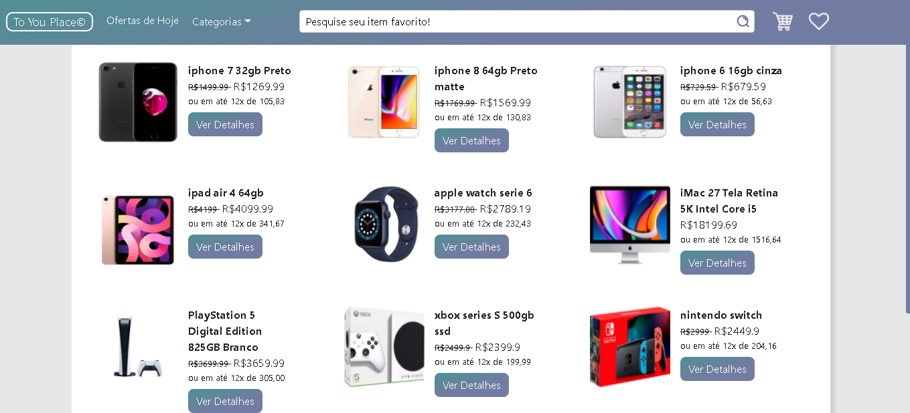

<h1>To you Place</h1>

<h2> Instalação local</h2>

Dentro do diretorio, Deve ser feito a instalação das dependencias com o seguinte comando:

<i>- npm install;</i>

<i>- Necessario utilizar o back-end do toYou_Place_backend em paralelo;</i>

<strong>Libs utilizadas:</strong> 

- Vue-router;

- Vue-simple-alert;

- Bootstrap-vue;

- Axios;

- Vuex;

- Vuex-persist;

 
 
 
 
 
 
 
